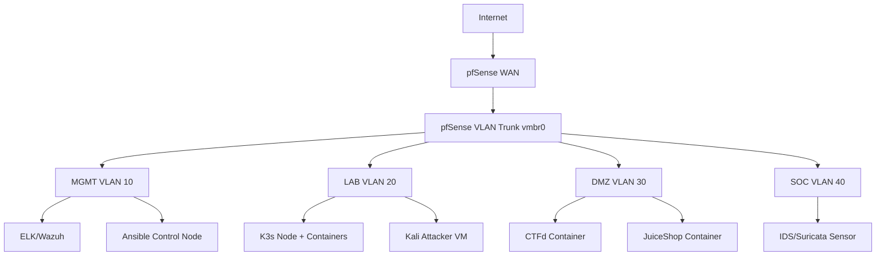

# Enterprise-Level SIEM Homelab Documentation

## Preface
This documentation describes the design, deployment, and configuration of an **enterprise-level SIEM homelab** built using Proxmox VE 9, pfSense, Kubernetes, Rocky Linux, and an ELK/Wazuh stack. The lab simulates a realistic enterprise network with segmented VLANs, multiple endpoints, and centralized security monitoring for red/blue team exercises and threat detection.

---

## Table of Contents
1. [Introduction](#introduction)
2. [Lab Objectives](#lab-objectives)
3. [Hardware and Host Setup](#hardware-and-host-setup)
4. [Network Architecture](#network-architecture)
5. [VMs and OS Choices](#vms-and-os-choices)
6. [SIEM Components](#siem-components)
7. [Deployment and Configuration](#deployment-and-configuration)
8. [Testing and Validation](#testing-and-validation)
9. [Future Enhancements](#future-enhancements)
10. [References](#references)

---

## Introduction
This homelab simulates an enterprise IT environment to study **Security Information and Event Management (SIEM)** workflows. The lab integrates multiple log sources, network sensors, and attack simulations to provide realistic security monitoring and SOC exercises.

---

## Lab Objectives
- Deploy a segmented enterprise network using VLANs and pfSense routing.
- Centralize logs from endpoints, servers, and network devices.
- Use ELK/Wazuh for log ingestion, correlation, and dashboards.
- Simulate attacks and observe detection using IDS/IPS and SIEM alerts.
- Enable red/blue team exercises in an isolated, controlled environment.

---

## Hardware and Host Setup
**Homelab Specs:**
- CPU: Ryzen 5 7600X
- RAM: 16 GB DDR5 (upgrade recommended for larger labs)
- GPU: RX 7900 XTX 24GB (optional, for ML/AI workloads)
- PSU: 850W Corsair Fully Modular
- Storage: 1TB SATA SSD

**Hypervisor:**
- Proxmox VE 9
- Single physical NIC with VLAN-aware `vmbr0` bridge for trunking multiple VLANs.

---

## Network Architecture

**VLAN Segmentation**

| VLAN | Purpose | CIDR | Example Machines |
|------|---------|------|----------------|
| 10   | MGMT / IT | 10.0.10.0/24 | ELK/Wazuh, Ansible, Management |
| 20   | LAB / Corporate | 10.0.20.0/24 | Employee clients, web servers, K3s nodes |
| 30   | DMZ / Public | 10.0.30.0/24 | JuiceShop, CTFd, public demo servers |
| 40   | Security / SOC | 10.0.40.0/24 | IDS/Suricata sensors, syslog servers |
| 99   | VPN / Remote | 10.0.99.0/24 | VPN endpoint, remote clients |

**Network Diagram**

## VMs and OS Choices

| VM / Container | Role | OS | VLAN | Resources |
|----------------|------|----|------|-----------|
| mg-elk         | SIEM Core | Rocky Linux 9 | 10 | 2 vCPU / 6 GB RAM / 30 GB |
| mg-ansible     | Control Node | Rocky Linux 9 | 10 | 1 vCPU / 1–2 GB RAM / 10 GB |
| lab-kali       | Attacker | Kali Linux Rolling | 20 | 2 vCPU / 2 GB RAM / 20 GB |
| lab-k3s-node1  | K8s Node | Rocky Linux 9 | 20 | 2 vCPU / 3 GB RAM / 20 GB |
| lab-dvwa       | Vulnerable Target | LXC Rocky Linux 9 | 20 | 1 vCPU / 1 GB RAM / 10 GB |
| dmz-ctfd       | CTF Portal | Rocky Linux 9 / container | 30 | 1 vCPU / 1–2 GB RAM / 20 GB |
| dmz-juice-shop | Demo App | Container | 30 | 512 MB – 1 GB RAM |

**Notes:**
- `mg-elk`: Central SIEM node; install ELK stack and optionally Wazuh manager.
- `mg-ansible`: Control node for automation; lightweight Rocky Linux LXC or VM.
- `lab-kali`: Attacker VM; runs penetration testing tools.
- `lab-k3s-node1`: Kubernetes node to host vulnerable applications and containerized workloads.
- Vulnerable targets (`lab-dvwa`) can be LXC containers to save RAM.
- DMZ services (`dmz-ctfd` and `dmz-juice-shop`) are containerized applications for external-facing simulations.
- Additional Windows or Linux VMs can be added later to simulate enterprise endpoints.

---

## SIEM Components

- **ELK Stack**: Elasticsearch, Logstash, Kibana — provides log storage, parsing, dashboards, and visualizations.
- **Wazuh**: Endpoint monitoring, file integrity, agent-based log collection, and alerting.
- **Suricata / Snort**: IDS/IPS sensors for network traffic monitoring and threat detection.
- **Filebeat / Metricbeat**: Lightweight agents installed on endpoints, containers, and servers to forward logs to ELK/Wazuh.
- **Attack Simulation**: Kali Linux VM generates simulated attacks, scans, and penetration testing events to trigger alerts and validate detection.

---

## Deployment and Configuration

### 1. pfSense VLAN Setup
- Create VLAN interfaces for:
  - MGMT (VLAN 10)
  - LAB (VLAN 20)
  - DMZ (VLAN 30)
  - SOC / Security (VLAN 40)
  - VPN / Remote Access (VLAN 99)
- Enable DHCP per VLAN or assign static IPs as needed.
- Configure firewall rules:
  - Allow management traffic from MGMT VLAN to all other VLANs as required.
  - Restrict lateral movement between LAB and DMZ VLANs.
  - Allow SOC VLAN to collect logs from all other VLANs.

### 2. SIEM / ELK Stack
- Install ELK stack on `mg-elk` VM:
  - Elasticsearch for storage and indexing.
  - Logstash for parsing and transforming logs.
  - Kibana for dashboards and visualizations.
- Install Wazuh manager on `mg-elk` or a separate VM.
- Deploy Wazuh agents and Filebeat/Metricbeat on all endpoints and container workloads.
- Configure log forwarding to central ELK stack.

### 3. Kubernetes / Containers
- Deploy K3s on `lab-k3s-node1`.
- Deploy vulnerable applications as container workloads:
  - **JuiceShop**, **DVWA**, **WebGoat**
- Configure container logging:
  - Forward stdout and application logs to Filebeat or directly to ELK/Wazuh.

### 4. Attack Simulation
- Use `lab-kali` VM to simulate attacks:
  - Network scanning (nmap, masscan)
  - Exploit testing (Metasploit Framework)
  - Web application attacks (OWASP ZAP, Burp Suite)
- Observe detection in SIEM dashboards.
- Use snapshots in Proxmox to reset VMs for repeated testing.

### 5. Dashboard and Correlation
- Configure Kibana dashboards to display:
  - Firewall logs (pfSense)
  - IDS/IPS alerts (Suricata)
  - Endpoint activity (Wazuh/Filebeat)
- Create correlation rules to trigger alerts for combined events:
  - Example: Failed logins + malware detection
- Optionally create alerting and notification pipelines via Wazuh or Elastic Watcher.

---

## Testing and Validation
- Test connectivity between VLANs respecting firewall rules.
- Confirm log collection from endpoints, containers, and network sensors.
- Simulate attacks from Kali VM and verify detection in dashboards.
- Test DHCP, DNS, VPN, and routing in pfSense for realistic network behavior.
- Use Proxmox snapshots to quickly reset the lab after exercises.

---

## Future Enhancements
- Add Windows Server / Active Directory domain controllers for enterprise realism.
- Deploy additional K3s nodes to simulate microservices workloads.
- Integrate additional SIEM solutions (Splunk, Grafana Loki) for comparative analysis.
- Enable machine-learning based anomaly detection with Elastic Security or OpenDistro.
- Implement automated playbooks using Ansible for lab deployment and reset.

---

## References
- [Proxmox VE 9 Documentation](https://pve.proxmox.com/pve-docs/)
- [pfSense Documentation](https://docs.netgate.com/pfsense/en/latest/)
- [Elastic Stack Documentation](https://www.elastic.co/guide/index.html)
- [Wazuh Documentation](https://documentation.wazuh.com/)
- [K3s Lightweight Kubernetes](https://k3s.io/)
